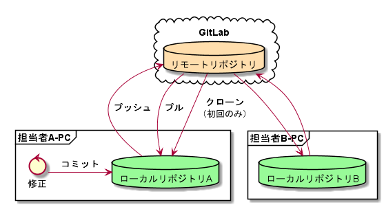

//////////////////////////////////////////////////////////////////////
// 文章の設定（Attribute）
//////////////////////////////////////////////////////////////////////

//ドキュメント種類
:doctype: book
//ドキュメント言語
:lang: ja
//目次生成
:toc:
//目次生成階層数
:toclevels: 2
//目次タイトル
:toc-title: 目次
//章番号生成
:sectnums:
//PDF化時の章タイトル
:chapter-label:
//シンタックスハイライト
:source-highlighter: coderay
//アイコンフォント
:icons: font
//UIマクロ
:experimental:
//HTML化時の画像のdata-uri要素化
:data-uri:
//画像ファイル格納先
:imagesdir: ./images
//HTML化時のスタイルファイル格納先
:stylesdir: ./style
//HTML化時のスタイルファイル
:stylesheet: asciidoctor-default.css
//PDF化時のスタイルファイル
:pdf-style: ./style/public_style.yml
//PDF化時のフォントファイル格納先
:pdf-fontsdir: ./fonts

//////////////////////////////////////////////////////////////////////
// 表紙
//////////////////////////////////////////////////////////////////////

//ドキュメントタイトル、表紙に入る
ifdef::env-user[]
= AsciiDoc ユーザーマニュアル
endif::[]
ifdef::env-admin[]
= AsciiDoc ユーザーマニュアル（詳細版）
endif::[]
//ドキュメントタイトル、ヘッダーに入る
ifdef::env-user[]
:docname: AsciiDoc ユーザーマニュアル
endif::[]
ifdef::env-admin[]
:docname: AsciiDoc ユーザーマニュアル（詳細版）
endif::[]
//著者
:author:
//改定番号
:revnumber: K0.1
//改定日
:revdate: 2019/08/24
//改定番号のラベル
:version-label:
//ロゴ画像
//:title-logo-image:
//表紙背景画像 
//:title-page-background-image:

//////////////////////////////////////////////////////////////////////
// 本文
//////////////////////////////////////////////////////////////////////

== 配布パッケージについて

* *中身は以下の通り*
+
----
AsciiDocPackage/
├ template/                     // 文章のテンプレート一式
   ├ csv/                            // CSVファイルを格納
   ├ fonts/                　　　    // フォントファイルを格納
   ├ images/               　　      // イメージファイルを格納
   ├ style/                　　    　// スタイルファイルを格納
   ├ make_pdf_test.bat               // AsciiDoc→PDF変換用スクリプト
   └ test.adoc                       // AsciiDocドキュメントのテストサンプル
   └ test2.adoc                      // AsciiDocドキュメントのテストサンプル2
├ tool/                    　　 // インストール用バッチファイル
   ├ ①ChocolateyInstall.bat
   ├ ②ChocolateyPackageInstall.bat
   ├ ③AsciiDocToolInstall.bat
   └ ④VScodeExtensionInstall.bat
└ AsciiDocUserManual.pdf        // 手順書
----

== AsciiDocについて

* *AsciiDocとは？*
** 文章を記述するするための記法（軽量マークアップ言語）の一つ
** プレーンテキスト（対義語：リッチテキスト）で体裁が整った文章が書ける
** 可読性が高くマークダウン記法の中でも表現力が高い

== 仕様書作成にAsciiDocを選択した背景

=== 従来の仕様書作成の問題点
* *不適切なバージョン管理*
** ガバガバな命名規則
*** 日付ファイル名（作成日？編集日？発行日？）
*** 編集者名や編集中や最新と付いたファイル
** 管理場所が複数
*** バックアップ用にコピーファイルが散乱
*** Origianalファイルの修正に追従しづらい
* *不適切な履歴管理*
** 更新履歴シート
*** 複数の変更箇所もまとめて更新しがち
*** 変更の経緯までは残しにくい
*** そもそも書かない
** 変更箇所を探しにくい
*** 変更箇所は色付き（次の編集者が色消して追えなくなる）
*** 簡単に差分抽出ができない
* *不適切な品質管理*
** レビューされない
*** 間違った仕様や完成度の低い仕様がそのままリリースされる
*** 変更内容が共有されない（担当者のみぞ知る）
* *本質的ではない作業*
** 罫線、文字色、フォント種別、目次、章番号
*** いちいちキーボードからマウスに持ちかえてリボンから選択
*** 選択肢が多くて無駄に選ぶ時間がかかる
* *生産性*
** とにかく重くなりがち
*** ファイルサイズの肥大化により開けない、スクロールが遅い
*** Microsoft Wordは動作を停止しました...

<<<
=== AsciiDocによる仕様書作成のメリット
* *不適切なバージョン管理、履歴管理、品質管理*
** バージョン管理ツールのGitとの相性が良い
*** 仕様書を一元管理できる
*** Originalファイルへは影響を与えず（常にリリース可能な状態に保たれる）ローカルで編集可能
*** 必然とローカル環境に複製されるので分散開発しやすく障害に強い
*** 変更は全て記録されていて、過去の変更を簡単に参照できる
*** テキストベースなので変更箇所の差分抽出が容易にできる
*** プルリクエストによりメンバーに周知とレビューを兼ねられる
* *本質的ではない作業、生産性*
** AsciiDocが解決！
*** 煩わしいマウス操作は不要で全てテキストベースで作業が行える（文章構造の明示や装飾、テーブル記法まで）
*** 記法が少ないことで良い意味で制限がかかり、担当者差が出にくくドキュメントに統一感が出る
*** 編集するツールに限定されない（書くだけならエディタは何でもよい）
*** テキストそのままでも可読性の高いドキュメントになるため必然的に簡潔な内容になりレビューしやすい
*** 対応アプリの拡張機能で簡単にプレビュー環境をつくれて快適に読み書きできる
*** シーケンス図などをPlantUMLでテキストベースで書いて埋め込み可能
*** 外部ファイルのインクルードも可能
*** コードのコメントアウトが可能（可読性は保ちつつ、変更の経緯や設計根拠も残しやすい）
*** 展開用にHTML化やPDF化なども可能
*** テキストベースなのでとにかく軽い！

== 環境構築手順

=== はじめに

本書では、AsciiDocのテキストエディタとして Visual Studio Code を利用することとします。 +
また、Gitを視覚的に操作できるSourceTreeを利用して、AsciiDocドキュメントのバージョン管理を行います。

以下の環境で動作を確認しています。

* Windows 10 Home (64bit)
* .NET Framework 4.0以上（※Windows 7 環境の場合、標準搭載は 3.5.1 のためVerUpが必要です）
* Chocolatey 0.10.15
** ruby 2.6.3.1
*** asciidoctor 2.0.10
*** asciidoctor-pdf 1.5.0.beta.3
*** asciidoctor-pdf-cjk 0.1.3
*** asciidoctor-diagram 1.5.18
*** coderay 1.1.2
** Graphviz 2.38.0.20190211
** jdk8 8.0.221
** Maven 3.6.1.20190711
** Visual Studio Code 1.38.1
*** AsciiDoc 2.7.6
*** Japanese Language Pack for Visual Studio Code 1.37.5
*** PlantUML 2.12.1
** SourceTree 3.1.3

<<<
:sectnums:
=== Chocolateyをインストール

:sectnums!:
==== 実施手順
. 以下のバッチファイルをダブルクリックで実行する
+
----
①ChocolateyInstall.bat
----
. ユーザーアカウント制御の許可のポップアップが出るので `はい` をクリック
. コマンドプロンプトが表示されて処理が進むので自動的に閉じたら完了

==== 実施内容（覚え書き）
* コマンドプロンプト（管理者権限）で以下を実行している
+
----
@"%SystemRoot%\System32\WindowsPowerShell\v1.0\powershell.exe" -NoProfile -InputFormat None -ExecutionPolicy Bypass -Command "iex ((New-Object System.Net.WebClient).DownloadString('https://chocolatey.org/install.ps1'))" && SET "PATH=%PATH%;%ALLUSERSPROFILE%\chocolatey\bin"
----
+
[NOTE]
====
公式サイト +
https://chocolatey.org/install#installing-chocolatey +

インストール手順解説（日本語） +
https://qiita.com/konta220/items/95b40b4647a737cb51aa
====

===== [black]#Chocolateyとは？#
* Windows上で動作するソフトウェアをコマンドラインでパッケージ管理可能なツール

===== [black]#メリット#
* Chocolateyのリポジトリに登録されているパッケージを**一発でインストール**できる
* Chocolateyでインストールしたソフトは**一括でアップデート**できる

<<<
:sectnums:
=== Chocolateyのリポジトリから各種パッケージをインストール

:sectnums!:
==== 実施手順

. 以下のバッチファイルをダブルクリックで実行する
+
----
②ChocolateyPackageInstall.bat
----

. ユーザーアカウント制御の許可のポップアップが出るので `はい` をクリック

. コマンドプロンプトが表示されて処理が進むのでしばらく待つ

. 下記画面が表示されたら `ライセンスに同意します` にチェックを入れて `次へ` をクリック +
+
image::Sourcetree02.png[width="300",align="left"]

. `Atlassianアカウント` を選択して `次へ` をクリック +
+
image::Sourcetree03.png[width="300",align="left"]

. `Enter email` にメールアドレスを入力して `Continue` をクリック +
+
image::Sourcetree04.png[width="200",align="left"]

. 続けて、 `Enter full name` にニックネーム、 `Create password` にパスワードを求められるので入力して、 `Sign up` をクリック（※既にアカウントを持っている場合は通常のサインインを行う） +
+
image::Sourcetree05.png[width="200",align="left"]

. reCAPTCHAの画像認証の指示に従って選択を行い、 `確認` をクリック +
+
image::Sourcetree06.png[width="200",align="left"]

. 認証に成功すれば登録完了画面に遷移するので、 `次へ` をクリック +
+
image::Sourcetree07.png[width="300",align="left"]

. ツールのインストール画面に遷移するので `Git` にだけチェックを入れて、 `次へ` をクリック（※既にGitをインストール済みの場合はそのまま `次へ` をクリック） +
+
image::Sourcetree08.png[width="300",align="left"]

. `SSHキーを読み込みますか？` が表示されたら `いいえ` をクリック +
+
image::Sourcetree09.png[width="300",align="left"]

. Sourcetreeが自動的に立ち上がったのが確認できたらアプリを一旦閉じる +
+
image::Sourcetree10.png[width="300",align="left"]

. コマンドプロンプトの画面内にて、Atlassianアカウントを作成完了したか聞かれるので、 +
完了していたら `y` 、完了していなければ `n` を入力して kbd:[Enter] を押す +
`y` の場合 ： コマンドプロンプトが表示されて処理が進むので自動的に閉じたら完了 +
`n` の場合 ： 再度、kbd:[Enter] を押すとコマンドプロンプトが閉じる +

==== 実施内容（覚え書き）

* コマンドプロンプト（管理者権限）で以下を実行している
+
----
cinst ruby -y //<1>
cinst graphviz -y //<2>
cinst jdk8 -y //<3>
cinst maven -y //<4>
cinst vscode -y //<5>
cinst sourcetree --version 2.5.5 -y //<6>
----
<1> Ruby （AsciiDoc関連ツールを利用するのに必要）
<2> Graphviz （PlantUMLのレンダリングライブラリとして必要）
<3> Java （PlantUMLの動作環境として必要）
<4> Maven （Javaのプロジェクト管理ツールでPlantUMLの爆速プレビューに必要）
<5> Visual Studio Code （AsciiDocをプレビュー可能なテキストエディタ）
<6> SourceTree （GitのGUIツール）

* Atlassianアカウントを作成してSourceTreeのサインインに成功したら +
コマンドプロンプト（管理者権限）で以下を実行しアップデートする
+
----
choco upgrade all -y
----
+
[NOTE]
====
初めから最新verをインストールしないのはBitbucketに登録せずに利用するため +
https://hepokon365.hatenablog.com/entry/2019/03/25/222814
====

<<<
:sectnums:
=== AsciiDoc関連ツールをインストール

:sectnums!:
==== 実施手順
. 以下のバッチファイルをダブルクリックで実行する
+
----
③AsciiDocToolInstall.bat
----

. コマンドプロンプトが表示されて処理が進むので自動的に閉じたら完了

==== 実施内容（覚え書き）

* コマンドプロンプトで以下を実行している
+
----
gem install asciidoctor //<1>
gem install --pre asciidoctor-pdf //<2>
gem install asciidoctor-pdf-cjk //<3>
gem install asciidoctor-diagram //<4>
gem install coderay //<5>
----
<1> AsciiDoc→HTMLに変換用
<2> AsciiDoc→PDFに変換用
<3> PDF変換のレイアウト崩れ対応用
<4> PlantUML等の図の記述および出力用
<5> コードのシンタックスハイライト用

* 社内のネットワークから実施する場合はgemにproxyを指定する
+
----
gem install xxxx -p proxy http://アドレス:ポート
----
+
[NOTE]
====
proxyの確認手順 +
https://pasokatu.hateblo.jp/entry/2017/07/04/111147
====

<<<
:sectnums:
=== VScodeの拡張機能をインストール

:sectnums!:
==== 実施手順
. 以下のバッチファイルをダブルクリックで実行する
+
----
④VScodeExtensionInstall.bat
----

. コマンドプロンプトが表示されて処理が進むので自動的に閉じたら完了

==== 実施内容（覚え書き）
* コマンドプロンプトで以下を実行している
+
----
code --install-extension joaompinto.asciidoctor-vscode ^ //<1>
code --install-extension MS-CEINTL.vscode-language-pack-ja ^ //<2>
code --install-extension jebbs.plantuml ^ //<3>
----
<1> ASciiDocのプレビュー用
<2> 日本語表示用
<3> PlantUMLの爆速プレビュー用
+
[NOTE]
====
[表示]→[拡張機能]から検索してインストール or コマンドラインからインストール +
https://qiita.com/Kosen-amai/items/03632dee2e1694652f06 +
====

:sectnums:
== 使い方

=== VScodeで実際にAsciiDocを書いてみる
ここでは、テストサンプルでプレビューやPDFへの変換を行い、正しく環境構築ができたことを確認します。 +
テストサンプルの内容は、AsciiDocの文法紹介も兼ねているので参考にしてください。

:sectnums!:
==== 作業ディレクトリを作成する
配布パッケージ内のtemplateフォルダ一式をローカルPCの任意の場所にコピーして使います。 +
このフォルダ一式が文章のテンプレートとなります。 +

==== 作業ディレクトリの作成方法（覚え書き）
* 文章作成のための作業ディレクトリを用意
+
----
├ template/                     // 文章のテンプレート一式
   ├ csv/                            // CSVファイルを格納
   ├ fonts/                　　　    // フォントファイルを格納
   ├ images/               　　      // イメージファイルを格納
   └ style/                　　    　// スタイルファイルを格納
----

* HTMLのスタイルファイルを用意 +
asciidoctorの配布ファイルがWindowsの場合は以下にあるのでコピペして利用
+
----
// ruby2.6でasciidoctorのverが2.0.10の場合
C:\tools\ruby26\lib\ruby\gems\2.6.0\gems\asciidoctor-2.0.10\data\stylesheets\asciidoctor-default.css
----

* PDFのスタイルファイルを用意 +
asciidoctor-pdfの配布ファイルがWindowsの場合は以下にあるのでコピペして利用
+
----
// ruby2.6でasciidoctor-pdfのverが1.5.0.beta.2の場合
C:\tools\ruby26\lib\ruby\gems\2.6.0\gems\asciidoctor-pdf-1.5.0.beta.2\data\themes\default-theme.yml
----
+
[NOTE]
====
デフォルトのスタイルファイル +
css ：そのままでも十分使えそう +
yaml：いまいちなのでHTML化時のスタイルに寄せた設定に修正してみた（public_style.ymlとして利用） +

公式サイト +
https://github.com/asciidoctor/asciidoctor-pdf/blob/master/docs/theming-guide.adoc +

色表現 +
https://www.lab-nemoto.jp/www/leaflet_edu/ColorMaker.html +

PDF化時に文字の色が変わるようにする +
https://blog.siwa32.com/asciidoctor_pdf_color/ +
→「2.2 asciidoctor-pdfのソースを修正する」
====

* フォントファイルを用意 +
asciidoctor-pdfの配布ファイルがWindowsの場合は以下にあるのでコピペして利用
+
----
// ruby2.6でasciidoctor-pdfのverが1.5.0.beta.2の場合
C:\tools\ruby26\lib\ruby\gems\2.6.0\gems\asciidoctor-pdf-1.5.0.beta.2\data\fonts\*.ttf
----
+
[NOTE]
====
カスタマイズ参考サイト +
https://ryuta46.com/267 +
https://qiita.com/kuboaki/items/67774c5ebd41467b83e2 +
====

* ドキュメントファイルを用意 +
適当にメモ帳で以下の設定で作成する
+
----
拡張子 : .adoc
文字コード : UTF-8
----

* 格納後の作業フォルダ内はこんな感じになる +
+
----
├ template/
   ├ csv/
   ├ fonts/
      ├ *.ttf
      └ ...
   ├ images/
   └ style/
      ├ asciidoctor-default.css
      ├ default-theme.yml
      └ public_style.yml
   └ *.adoc
----

==== VScode を起動する
AsciiDocで書くためのテキストエディタとして使用します。 +
Windowsのスタートメニューから `Visual Studio Code` （以下、VScodeとする）を検索して起動します。 +

==== テストサンプルを開く
[ファイル]→[ファイルを開く]から `template` フォルダ内の `test.adoc` ファイルを開きます。 +

==== テストサンプルをプレビューする

===== [black]#asciidoctorの設定を変更する#
VScode上でプレビュー表示を行うための設定を行います。 +
[ファイル]→[基本設定]→[設定]から `asciidoctor` を検索し、以下の設定を行います。
----
asciidoctor_command : asciidoctor -n -r asciidoctor-diagram -o-
asciidoctorpdf_command : asciidoctor-pdf -n -r asciidoctor-diagram -r asciidoctor-pdf-cjk -o-
use_asciidoctor_js  : false(チェックを外す)
----

image::VScodeSetting.png[]

===== [black]#プレビューを行う#
ショートカット kbd:[Ctrl+K] → kbd:[V] で画面右側にプレビューが表示されます。 +
参考までにテストサンプルのプレビュー結果を以下に示します。

image::TestPreviewResult.png[]

===== [black]#プレビューを行う（PlantUML図作成時）#
VScodeの拡張機能を使用してプレビューを行う際、通常はAsciiDocでのプレビューで問題ないですが、PlantUML図の編集中はAsciiDocではなくPlantUMLを使ってプレビューした方が圧倒的に反応が早いので、やり方を説明しておきます。

. 以下から、PlantUML Server リポジトリをローカルPCの適当な場所にクローンします（初回のみ実施）。 +
https://github.com/plantuml/plantuml-server

. コマンドでサーバーを立ち上げます（次回以降も実施）。 +
手順1にてクローンした場所をエクスプローラーで開きます。
+
image::plantumlserver1.png[width="600",align="left"]
+
エクスプローラーの上のバーに `cmd` と入力して kbd:[Enter] 
を押すと、コマンドプロンプトでこの場所を開くことができます。
+
image::plantumlserver2.png[width="600",align="left"]
+
コマンドプロンプトが起動したら、下記コマンドを打つと、サーバーが立ち上がります。
+
----
mvn jetty:run
----

. VScodeの設定を変更します（初回のみ実施）。 +
[ファイル]→[基本設定]→[設定]から `plantuml` を検索し、以下の設定を行います。
+
----
Render : PlantUMLServer
Server : http://localhost:8080/plantuml
----
+
image::plantumlserver3.png[]

. PlantUMLのブロック内の最初と最後に@startumlと@endumlを指定します。 +
編集中のみ指定を行い、最終的には不要なので消してください。
+
----
[plantuml, test]
--
@startuml

この間に書きます

@enduml
--
----

. @startuml～@endumlの間にカーソルを持ってきて、ショートカット kbd:[Alt + D] で画面右側にプレビューが表示されます。
+
[NOTE]
====
* PlantUML爆速プレビュー +
https://qiita.com/Ping/items/64930e8c21fb95bec095 +

* PlantUML図の書き方 +
https://qiita.com/ogomr/items/0b5c4de7f38fd1482a48 +
http://yohshiy.blog.fc2.com/blog-category-22.html +
====

==== テストサンプルをPDFに変換する

. 以下のバッチファイルをダブルクリックで実行する
+
----
make_pdf_test.bat
----

. コマンドプロンプトが表示されて処理が進むので自動的に閉じたら完了

. `test.pdf` が作成されます
+
[NOTE]
====
必要に応じてバッチファイル内のファイル名を修正して使ってください +
`**-o** 変換後ファイル名**.pdf** 変換前ファイル名**.adoc**`
====

==== 変換方法（覚え書き）

* コマンドプロンプトで以下を実行している（*にファイル名を指定）
+
----
asciidoctor -r asciidoctor-diagram -o *.html *.adoc //<1>
asciidoctor-pdf -r asciidoctor-diagram -r asciidoctor-pdf-cjk -o *.pdf *.adoc //<2>
----
<1> AsciiDoc→HTML化用コマンド
<2> AsciiDoc→PDF化用コマンド

<<<
:sectnums:
=== AsciiDocで書いた文章をGitで管理する

==== Gitとは？
分散型バージョン管理システムの一つです。 +
**リポジトリ**と呼ばれる記録場所に、管理したい**ファイルやディレクトリの状態を記録（変更履歴を保存）**することができます。 +
リポジトリを複数用意できる（開発者がそれぞれのローカルにリポジトリを持てる）ので、分散型と呼ばれています。

image::Git.png[]

以降では簡単な説明にとどめますので、以下のサイトも参考にして下さい。 +

＜サルでもわかるGit入門＞ +
https://backlog.com/ja/git-tutorial/

<<<
==== 状態の変化を記録するコミット
**コミット**と呼ばれる操作により、変更作業により発生したファイルやディレクトリの状態の変化をリポジトリに記録します。

. 管理下に置かれた作業ディレクトリ（**作業ツリー**）から、コミット予定エリア（**インデックス**）に、変更したファイルを**追加（ステージング）**します。

. **コミットメッセージ**を付けることができ、**コミット**を実行すると、前回コミットした時の状態から現在の状態までの差分を記録したコミットが作成されます。
+
----
//コミットメッセージ
1行目 : コミットでの変更内容の要約
2行目 : 空行
3行目以降 : 変更した理由
----

image::Commit.png[]

[NOTE]
====
このようにインデックスを挟むことで、変更されてないファイルを含めずにコミットでき、 +
また、ファイルの一部の変更だけを追加してコミットすることもできたりします。
====

過去のコミットを辿れば、過去の状態に一時的に戻したり参照したりすることができます。 +
そのため、バックアップ用のファイルを別名で残す必要はありません。

<<<
==== 履歴を管理するリポジトリ
リポジトリには2種類あります。

* **リモートリポジトリ**
** 専用のサーバに配置して複数人で共有するためのリポジトリ
* **ローカルリポジトリ**
** ユーザ一人ひとりが利用するために、自分の手元のPC上に配置するリポジトリ

普段の作業はローカルリポジトリで行い、作業が完了したらリモートリポジトリにアップロード（**プッシュ**）して公開します。 +
リモートリポジトリを通して公開された最新のディレクトリの状態を別の開発者が取得（**プル**）することもできます。

[NOTE]
====
リモートリポジトリには、無料で使えるがインターネット上に一般公開されるGitHubと、自前のサーバーに立ててプライベートリポジトリとして使えるGitLabがある（自社では後者を使用する）
====

なお、プッシュの代わりに、**プルリクエスト**を使うことで組織にレビューの文化を根付かせることも可能です。 +
プルリクエストは次のような機能を提供します。

* 機能追加や改修など、作業内容がレビュー・マージ担当者やその他関係者に通知される
* ソースコードの変更箇所がわかりやすく表示される
* ソースコードに関するコミュニケーションの場が提供される

上記のようなやりとりを経て、最終的にマージされるソースコードの品質を高めることが可能です。

<<<
==== 運用フロー
初めにリモートリポジトリをローカルに複製（**クローン**）します。 +
以降はローカルリポジトリにて変更作業を行っていきますが、自社では以下の手順を遵守することとします。 +

. 変更作業を始める前に、最新の状態をリモートリポジトリから**プルし直す**
. 変更作業はmasterブランチでは行わず、**ブランチを切って移動**して行う
. 移動先のブランチ内にて、変更作業を行い、**変更箇所ごとに都度コミット**を実行する
. 全ての変更作業を終えたら、masterブランチに移動し、最新の状態をリモートリポジトリから**プルし直す**
. 変更作業中のブランチに再び移動し、**masterブランチへのマージ**を行う
. マージの際に、他の開発者による変更との競合が発生した場合は、**競合内容を確認し修正をコミット**する
. リモートリポジトリへ**プッシュする**（または、プルリクエストを行う）

image::Flow.png[]

この運用の一番の目的は、**リモートリポジトリは常にリリースできる状態に保つこと**、です。 +
そのため、**ローカルリポジトリのmasterブランチは最新に保つ**ことを心掛け、**編集はブランチを切って行います** 。 +
リモートリポジトリの最新の状態（origin/masterブランチ）より**先行した状態にしてから**リモートリポジトリにプッシュします。

<<<
==== ドキュメントのバージョン管理
gitではコミットに対してコミットメッセージとは別にタグを付けることができます（後付け可能）。 +
変更履歴上の重要なポイントへの印として一覧表示で参照も可能で、主にリリースポイントとして使われます。 +
自社では、タグにバージョンを明記して管理することとします。 +

タグ記載ルール 「**a_x.y.z**」

* a : プロダクト名
* x : プロダクトとしての正式発行ver（0:Draft、1:初期提示、2～:各フェーズに応じてなど）
* y : プロダクトとしての仕様変更ver（0:正式発行時で固定、1～:ソフト屋さんにも展開する仕様変更でカウントUP）
* z : プロダクトとしての開発管理ver（0:正式発行時で固定、1～:ソフト屋さんには未展開の開発管理でカウントUP）

前提として、標準仕様とバイプロ仕様のように仕様書を別管理としていた従来のやり方は、今後はやめます。 +
AsciiDocでは、仕様書は一つで、`ifdef ～ endif` で条件によって表示/非表示を切り替えることで、 +
プロダクト別の仕様書に早変わりできるような作りを目指します（ifdefの使い方はテストサンプル参照）。 +
従って、仕様の記載を追加することはあっても削除することはできない（許されない）ので、 +
常に他のプロダクトの仕様を参照しながら作成ができ、仕様の水平展開や標準化を意識した作りにできます。

<<<
==== SourceTreeを使って運用する
. まず、SourceTreeにGitLabアカウントを登録します。 +
[ツール]→[オプション]のデフォルトユーザー情報に、GitLabで登録したユーザー名とメールアドレスを入力します。
+
image::UserInfo.png[width="700",align="left"]

. これまで説明してきた作業は、GitのGUIツールであるSourceTreeを使用して行いますが、 +
以下の参考サイトに初心者でもわかるようにまとまっているので説明は割愛します +
+
＜誰でも簡単！GitHubで管理するためのSourcetreeの最低限の使い方＞ +
https://haniwaman.com/sourcetree/ +
+
＜SourceTreeの使い方|初心者が習得するべき基本操作＞ +
https://ics.media/entry/1365/ 

展開したり共有する必要がない資料は、ローカルリポジトリだけで運用してバージョン管理することもできます。 +
ローカルに保存先のパス（作業ディレクトリ）を指定して、リポジトリを作成（**クリエイト**）してみて、色々試してみると良いです。 +

習うより慣れろ、です！

*以上で終わりです！*
